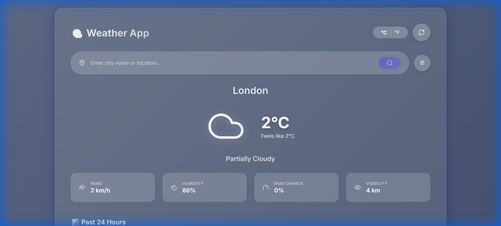
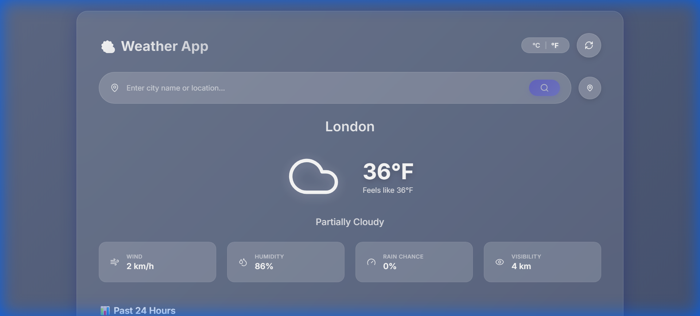
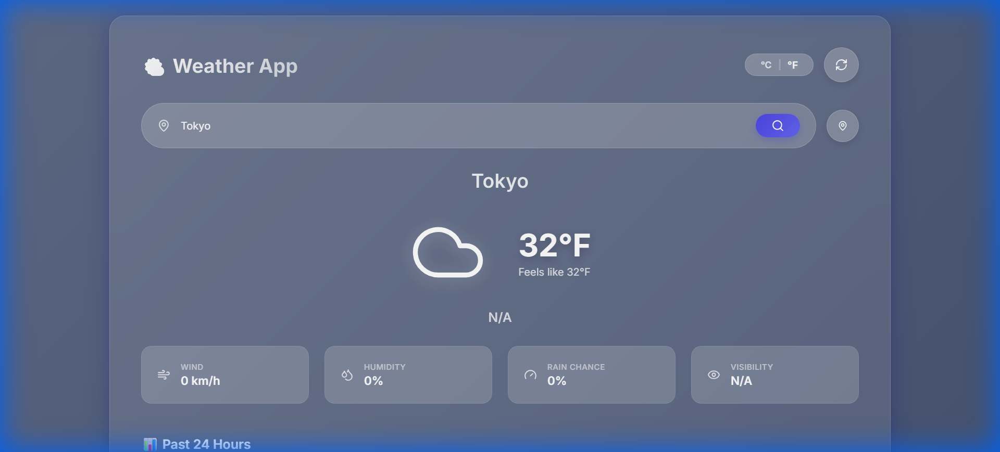
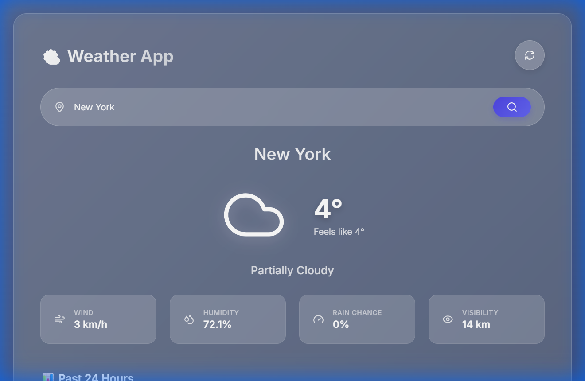
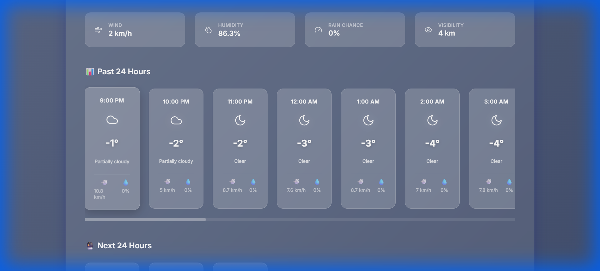
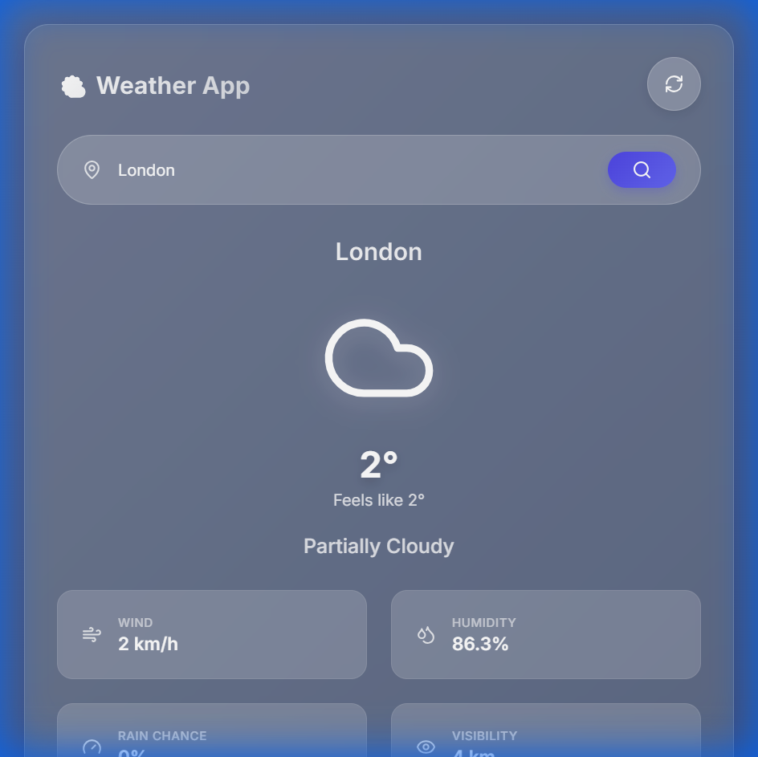

# ⛅ Weather Web App

A premium, feature-rich weather application built with React and Vite, showcasing real-time weather data with a stunning glassmorphism UI design.

**🌐 Live Demo:** [https://aerocast-io.netlify.app](https://aerocast-io.netlify.app)


---

## ✨ Features

### Core Functionality
- 🌍 **Global Weather Search** - Get weather for any city worldwide
- 📍 **Geolocation Support** - Automatically detect and display local weather
- 🌡️ **Temperature Toggle** - Switch between Celsius and Fahrenheit
- 📊 **24-Hour Forecasts** - View past and future 24-hour weather trends
- 🔄 **Auto-Refresh** - Update weather data with a single click

### Weather Details
- ☀️ Current temperature with "feels like" reading
- 💨 Wind speed
- 💧 Humidity levels
- 🌧️ Precipitation probability
- 👁️ Visibility range
- 🔆 **UV Index** with color-coded health risk warnings (Low → Extreme)

### UI/UX Highlights
- 🎨 **Glassmorphism Design** - Modern frosted-glass aesthetic
- 🌈 **Dynamic Themes** - Background changes based on weather conditions
- ✨ **Smooth Animations** - Powered by Framer Motion
- 📱 **Fully Responsive** - Optimized for mobile, tablet, and desktop
- 🎭 **Interactive Elements** - Hover effects and micro-interactions
- ♿ **Accessible** - Color-coded warnings and clear error messages

---

## 🛠️ Tech Stack

### Frontend Framework
- **React 18** - UI library
- **Vite 6** - Build tool and dev server

### Styling & Animation
- **Vanilla CSS** - Custom styling with CSS variables
- **Framer Motion** - Animation library
- **Glassmorphism** - Modern UI design pattern

### Icons & Assets
- **Lucide React** - Modern icon library

### API
- **Visual Crossing Weather API** - Real-time global weather data

---

## 📦 Dependencies

```json
{
  "dependencies": {
    "framer-motion": "^11.15.0",
    "lucide-react": "^0.468.0",
    "react": "^18.3.1",
    "react-dom": "^18.3.1"
  },
  "devDependencies": {
    "@eslint/js": "^9.17.0",
    "@types/react": "^18.3.18",
    "@types/react-dom": "^18.3.5",
    "@vitejs/plugin-react": "^4.3.4",
    "eslint": "^9.17.0",
    "eslint-plugin-react": "^7.37.2",
    "eslint-plugin-react-hooks": "^5.0.0",
    "eslint-plugin-react-refresh": "^0.4.16",
    "globals": "^15.14.0",
    "vite": "^6.0.5"
  }
}
```

---

## 🚀 Getting Started

### Prerequisites
- Node.js (v18 or higher)
- npm or yarn
- Visual Crossing API key ([Get one free](https://www.visualcrossing.com/weather-api))

### Installation

1. **Clone the repository**
```bash
git clone https://github.com/Ravi-667/Weather-Web-App.git
cd Weather-Web-App
```

2. **Install dependencies**
```bash
npm install
```

3. **Configure environment variables**
```bash
# Create .env file in root directory
echo "VITE_WEATHER_API_KEY=your_api_key_here" > .env
```

4. **Start development server**
```bash
npm run dev
```

5. **Open in browser**
```
http://localhost:5173
```

---

## 🏗️ Build for Production

```bash
# Create optimized production build
npm run build

# Preview production build locally
npm run preview
```

The production-ready files will be in the `dist/` directory.

---

## 📁 Project Structure

```
Weather-Web-App/
├── public/                  # Static assets
├── src/
│   ├── api/
│   │   └── weather.js      # Weather API integration
│   ├── components/
│   │   ├── CurrentWeather.jsx
│   │   ├── ForecastStrip.jsx
│   │   ├── SearchBar.jsx
│   │   ├── WeatherIcon.jsx
│   │   ├── LoadingSpinner.jsx
│   │   ├── TemperatureToggle.jsx
│   │   └── GeolocationButton.jsx
│   ├── utils/
│   │   └── temperature.js   # Temperature conversion utilities
│   ├── App.jsx              # Main app component
│   ├── App.css              # Global styles
│   ├── index.css            # CSS variables & themes
│   └── main.jsx             # App entry point
├── .env.example             # Environment variables template
├── package.json
└── README.md
```

---

## 🌐 Deployment

This app is deployed on **Netlify** with continuous deployment from GitHub.

### Live URL
**https://aerocast-io.netlify.app**

### Deployment Configuration
- **Build Command:** `npm run build`
- **Publish Directory:** `dist`
- **Environment Variable:** `VITE_WEATHER_API_KEY`

### Deploy Your Own

[](https://app.netlify.com/start/deploy?repository=https://github.com/Ravi-667/Weather-Web-App)

**Steps:**
1. Fork this repository
2. Sign up for [Netlify](https://www.netlify.com)
3. Click "Add new site" → "Import from Git"
4. Select your forked repository
5. Add environment variable: `VITE_WEATHER_API_KEY`
6. Deploy!

---

## 🎨 Features Showcase

### Temperature Unit Toggle
- Persistent preference (localStorage)
- Smooth conversion animations
- Applied across all temperature displays

### Geolocation
- Browser-based geolocation API
- Automatic coordinate-to-weather resolution
- Graceful error handling for denied permissions

### UV Index Display
- Color-coded badges:
  - 🟢 Low (0-2)
  - 🟡 Moderate (3-5)
  - 🟠 High (6-7)
  - 🔴 Very High (8-10)
  - 🟣 Extreme (11+)

### Error Handling
- Specific messages for different API errors
- Last successful location tracking
- Smart retry functionality

---

## 📝 Environment Variables

Create a `.env` file in the root directory:

```env
VITE_WEATHER_API_KEY=your_visual_crossing_api_key_here
```

**Get your API key:**
1. Visit [Visual Crossing Weather API](https://www.visualcrossing.com/weather-api)
2. Sign up for a free account
3. Copy your API key from the dashboard
4. Add it to your `.env` file

**Free Tier Limits:**
- 1,000 API calls per day
- Sufficient for development and personal use

---

## 🤝 Contributing

Contributions are welcome! Please feel free to submit a Pull Request.

1. Fork the repository
2. Create your feature branch (`git checkout -b feature/AmazingFeature`)
3. Commit your changes (`git commit -m 'Add some AmazingFeature'`)
4. Push to the branch (`git push origin feature/AmazingFeature`)
5. Open a Pull Request

---

## 📄 License

This project is licensed under the MIT License.

---

## 👤 Author

**Ravi Keservani**
- GitHub: [@Ravi-667](https://github.com/Ravi-667)

---

## 🙏 Acknowledgments

- [Visual Crossing Weather API](https://www.visualcrossing.com/) for weather data
- [Lucide](https://lucide.dev/) for beautiful icons
- [Framer Motion](https://www.framer.com/motion/) for smooth animations
- [Netlify](https://www.netlify.com/) for hosting

---

## 📸 Screenshots

### Main Interface - London Weather

*Clean, modern glassmorphism UI showing current weather conditions, 24-hour forecast strips, and all weather metrics*

---

### Temperature Toggle Feature

*Seamless switching between Celsius and Fahrenheit with smooth animations*

---

### Global Weather Search - Tokyo

*Search works for any city worldwide - showing Tokyo, Japan weather data*

---

### Different City - New York

*Real-time weather data for New York City with accurate temperature and conditions*

---

### 24-Hour Forecast View

*Interactive hourly forecast showing temperature trends and weather icons*

---

### Responsive Design - Tablet View

*Fully responsive layout adapting seamlessly to tablet and mobile devices*

---

**⭐ If you like this project, please give it a star on GitHub!**